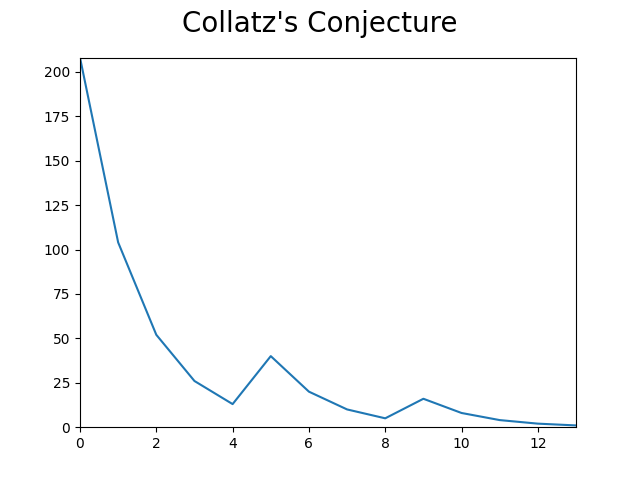

# VISULATION OF OSCILLATIONS of the Collatz Conjecture
## Collatz Conjecture is a piecewise function. If the number inputed is **even** then the function is *f(x) = x/2*. If the number inputed is **odd** then the function is *f(x) = 3x + 1*. After some iterations the result will **always** end up at 1.

# DEMO:

### Built using Matplotlib